<div align="center">

# DECIMEN

### Optical File Transfer

**Send a file between two devices through nothing but a screen and a camera.**

Fountain-coded animated QR codes. No cables. No network path. No pairing. No app. No cloud. Just light.

---

<p>
  
  
  
  
  
  
  
  
</p>

<p>
  <a href="#-overview"></a>
  <a href="#-quick-start"></a>
  <a href="#-how-it-works"></a>
  <a href="#-api-reference"></a>
  <a href="#-related-work"></a>
  <a href="#-license"></a>
</p>

</div>

---

## 🎯 Overview


| 🧩 **Piece** | 📜 **Description** |
|---|---|
| 🖥️ **Sender** (`send.php`) | Picks a file (demo or upload) and streams an **endlessly looping**, resize-aware, fullscreen-friendly QR animation. |
| 📱 **Receiver** (`receive.php`) | Camera-driven page that **auto-detects** session, grid, payload name, size — and reconstructs the file from any order. |
| 🔌 **API** (`api.php`) | Tiny JSON endpoint for listing, uploading, streaming (Range-supported), saving, and deleting payloads. |
| 🧮 **Fountain code** | Luby-Transfer (LT) codes — reassembles from any ~K·1.18 distinct frames in **any order**. |
| 🔐 **Protocol** | Self-describing 24+nameLen byte header — no handshake, no negotiation. |

---

## 📸 Visual Tour

<table>
  <tr>
    <td align="center"><b>🏠 Landing</b></td>
    <td align="center"><b>📡 Sender</b></td>
    <td align="center"><b>📷 Receiver</b></td>
  </tr>
  <tr>
    <td>Hero • Cards • Steps</td>
    <td>Live QR canvas • Auto-resize • Fullscreen</td>
    <td>Camera • Auto-zoom • Auto-decode • Progress</td>
  </tr>
  <tr>
    <td>Dark monospace • Amber accent</td>
    <td>Wake-Lock • Live stats (FPS · KB/s)</td>
    <td>Grid-aware • jsQR fallback • Save-to-server</td>
  </tr>
</table>

---

## ⚡ Quick Start

> 🪟 **Works on Windows / Linux / macOS** with XAMPP (Apache + PHP ≥ 8.1).

```bash
# 1. Drop the folder into your XAMPP htdocs:
#    e.g. C:\xampp\htdocs\decimen.dfs.lan\
#         /opt/lampp/htdocs/decimen.dfs.lan/

# 2. Make sure Apache is running (XAMPP Control Panel → Start Apache)

# 3. On THIS computer (sender side):
xdg-open http://localhost/decimen.dfs.lan/send.php        # Linux
open      http://localhost/decimen.dfs.lan/send.php        # macOS
start     http://localhost/decimen.dfs.lan/send.php        # Windows
```

> 🛑 **Don't open the folder path in a browser** (`C:\xampp\htdocs\decimen.dfs.lan\…`) — that's the disk, not the site. Always use `http://localhost/decimen.dfs.lan/`.

### 📱 From the **phone** (receiver side)

The receiver needs the camera, and browsers only grant camera access over **HTTPS**. XAMPP already ships with a self-signed cert:

```text
https://<this-pc-LAN-IP>/decimen.dfs.lan/receive.php
```

✅ Accept the cert warning **once** (iOS: *Show Details → visit this website* · Android: *Advanced → Proceed*). The page becomes a **secure context** and the camera unlocks.


> 💡 `http://localhost/...` is exempt from the HTTPS rule — useful for testing on a single machine.

---

## 🧠 How It Works

```mermaid
flowchart LR
    A[📁 File<br/>≤ 64 MB] -->|split| B[🧩 K blocks]
    B -->|XOR random<br/>subsets| C[🔀 Fountain<br/>frames]
    C -->|encode| D[🟦 QR codes<br/>V1–V40]
    D -->|stream<br/>24 fps| E[📺 Sender<br/>screen]
    E -->|light| F[📷 Phone<br/>camera]
    F -->|decode| G[🟦 QR → bytes]
    G -->|LT peel| H[🧩 Reassembled<br/>blocks]
    H -->|verify<br/>FNV-1a| I[📁 Original<br/>file ✅]

    style A fill:#1a1a1a,stroke:#ffb257,color:#fff
    style I fill:#1a1a1a,stroke:#7dc98f,color:#fff
    style D fill:#0e0c0a,stroke:#ffb257,color:#ffb257
    style E fill:#0e0c0a,stroke:#ffb257,color:#ffb257
    style F fill:#0e0c0a,stroke:#ffb257,color:#ffb257
```




### 🌊 Fountain codes — the magic

The sender **never sends the file's blocks directly**. Each frame is the **XOR of a pseudorandom subset** of blocks; the subset is derived deterministically from the frame's sequence number, with subset sizes drawn from a **robust-soliton distribution**. The receiver collects any `~K·1.18` distinct frames in any order and **peels the file out**.

> 🪄 **Dropped frames cost a little time — never correctness.**  
> 🪄 **No handshake. No pairing. The first decoded frame _is_ the handshake.**

### 🧬 Determinism guarantee

Sender and receiver both `import` the **same** `shared/fountain.js` (one copy of the code). It deliberately avoids `Math.log` (JS engines disagree by an ulp) in favour of a **deterministic log** built from exactly-specified IEEE-754 ops. **The two ends can never silently desynchronise.**

### 🖼️ Every frame is self-describing

| Offset | Type | Field |
|---|---|---|
| `0` | `u8` | magic `0xD1` |
| `1` | `u8` | magic `0x0D` (v2) |
| `2` | `u16` | `sessionId` |
| `4` | `u32` | `seq` |
| `8` | `u16` | `k` (source block count) |
| `10` | `u16` | `blockLen` |
| `12` | `u32` | `totalLen` |
| `16` | `u32` | `payloadFnv` (FNV-1a) |
| `20` | `u8` | `grid` (1 or 2) |
| `21` | `u8` | `flags` (bit 0 = gzip) |
| `22` | `u8` | `nameLen` |
| `23..` | `u8[]` | UTF-8 filename |

> 📏 **Header length = `24 + nameLen`. Frame total = `headerLen + blockLen`.**

---

## 🆚 What changed vs. the original

| Component | 🟦 Original (Vite) | 🟧 This edition (PHP) |
|---|---|---|
| 🖥️ Server | Vite dev server | **Apache + PHP** (`api.php`) |
| 🟦 QR encode | `node-qrcode` (npm) | **vendored `qrcodegen.js`** (Nayuki) |
| 🟦 QR decode | `zxing-wasm` (npm, ESM) | **vendored zxing-wasm IIFE + jsQR fallback** |
| 📜 Frame header | 20 bytes (fixed) | **23 + nameLen bytes** (filename + grid + flags) |
| 📁 Payloads | hard-coded demos | **upload any file ≤ 64 MB** via `send.php` or API |
| 📦 Transport | — | **optional gzip** (server keeps `.gz` copy; client decompresses) |
| 🟦 Grid mode | — | **2×2 grid: four fountain frames per animation frame** |

> ✅ The fountain code, the determinism story, the UI, and the protocol design follow the original edition — reimplemented here in PHP and vanilla JavaScript for the Apache stack.

---

## ⚙️ Setup

### 📋 Requirements

- 🧰 **XAMPP** (Apache + PHP ≥ 8.1, `mod_php`)
- ✅ `AllowOverride All` for `htdocs` (so `.htaccess` can raise upload limits)
- 🐘 PHP 8.2 confirmed
- 🪟 Cross-platform: Windows, Linux, macOS

### 🔧 Install

```bash
# 1. Drop the folder into htdocs
cp -r decimen.dfs.lan /opt/lampp/htdocs/        # Linux
xcopy /E decimen.dfs.lan C:\xampp\htdocs\       # Windows

# 2. Make storage/ and received/ writable
chmod -R 777 storage/ received/                  # Linux/macOS
```

`.htaccess` already sets `upload_max_filesize=64M`, `post_max_size=70M`, `max_execution_time=300`, `memory_limit=512M`. If your Apache ignores `.htaccess` (`AllowOverride none`), put these in `php.ini` instead:

```ini
upload_max_filesize = 64M
post_max_size       = 70M
max_execution_time  = 300
memory_limit        = 512M
```

### ▶️ Run

| Page | URL |
|---|---|
| 🏠 Landing | <http://localhost/decimen.dfs.lan/> |
| 📡 Sender | <http://localhost/decimen.dfs.lan/send.php> |
| 📷 Receiver | <http://localhost/decimen.dfs.lan/receive.php> |
| 🔌 API | <http://localhost/decimen.dfs.lan/api.php?action=list> |

---

## 🎬 Usage

### 📡 Sender (`send.php`)

1. **Pick a payload** from the dropdown (demo images ship in `public/`, anything uploaded appears here too) — or **upload your own** with the file input (≤ 64 MB).
2. **Tweak settings** (everything defaults to **auto**):
   - 🎞️ **tx fps** — 1–60 (default `auto` → 24)
   - 📦 **bytes/frame** — payload size hint (default `auto` → 1000 if `<512KB` else 1465)
   - 🛡️ **ECC level** — L / M / Q / H (default `auto` → L)
   - 📐 **display size** — `auto (fit screen)` / 300 / 500 / 700 / 900 / 1200
   - 🟦 **grid** — `auto` (1×1 for any file — reliable default) / 1×1 / 2×2 (opt-in for ~4× goodput)
   - 🔍 **QR size** — live 20–100% zoom (no restart)
3. **Drag the window, rotate the phone, go fullscreen** — the canvas **auto-rescales live** (no restart, no blank flash).
4. 📊 **Live line** updates every second: `<fps> FPS · <n> fountain frames sent · ~<kbps> KB/s payload`.
5. 🔆 Set the **screen to max brightness** and the stream loops forever.

> ✨ Changing any setting restarts the stream with a **fresh session id**; the receiver resets automatically.

### 📷 Receiver (`receive.php`)

1. Tap **Start camera** — capture width / fps / worker count default to **auto** (resolved to 960 / 60 / 2).
2. **Point it at the sender's screen** — on the first decoded frame the status line shows:
   ```text
   auto-detect ✓ session #N · name · KB · K blocks · grid G×G — receiving…
   ```
3. 📊 Watch progress:
   - **frames new / dup** — honest decode count
   - **received KB / total KB** — real payload bytes
   - **decode fps** — processed camera frames
   - **KB/s payload** — matches the sender's line (÷ the ~1.18 fountain overhead)
4. 🪄 On completion you'll get:
   - 🖼️ **preview** (for images)
   - ⬇️ **download link**
   - 💾 **Save to server** button (writes to `received/` via the API)
5. ✅ **FNV-1a hash** is verified on completion — you'll see `hash verified ✓`.

> 🧠 The decoder **never needs to know how the sender is configured**. Each frame is self-describing, so it locks onto the mode mid-stream.

### 🧠 Decode ladder (cheapest → most expensive)

```text
1. 🔍 FAST PROBE      → ~720 px downscale + zxing (tryHarder off)  [hot path]
2. 🖼️ FULL-RES        → zxing, tryHarder off
3. 🔬 FULL-RES+       → zxing, tryHarder on (small/blurry QRs)
4. ⬆️  ONE UPSCALE    → capped at 1600 px, tryHarder on
5. 🟦 CELL SPLIT      → zxing per cell (grid mode only)
6. 🪂 jsQR FALLBACK   → pure-JS, last resort
```

### 🟦 Grid mode (2×2)

The sender renders **four different fountain frames** (`seq`, `seq+1`, `seq+K`, `seq+K+1`) as a 2×2 grid per animation frame. The receiver learns the grid size from the frame header but **decodes the whole image first**, so the grid can sit anywhere in the camera frame (off-center, bezel visible) and still decode — per-cell splitting is only a fallback.

| Setting | Effective speedup |
|---|---|
| 1×1 grid | baseline |
| 2×2 grid | **~4× goodput** (use 2–3 decode workers) |

---

## 🔌 JSON API

All responses are JSON. Errors are `{error, code}`.

| Action | Method | Purpose | Returns |
|---|---|---|---|
| `?action=list` | `GET` | List payloads | `{files:[{id,name,size,mtime,mime,gz,demo}]}` |
| `?action=upload` | `POST` (multipart `file`) | Store a payload | `{id,name,size,gz}` |
| `?action=stream&id=…&gz=0\|1` | `GET` | Raw bytes (or raw gzip bytes), **Range supported** | bytes |
| `?action=peek&id=…` | `GET` | Metadata | `{name,size,mime,gz,totalLen}` |
| `?action=save` | `POST` (JSON) | Store a received file | `{id,name,size,stored}` |
| `?action=delete&id=…` | `POST` | Remove an uploaded payload (demos protected) | `{deleted}` |

### 🧪 Smoke tests

```bash
# List payloads
curl http://localhost/decimen.dfs.lan/api.php?action=list

# Upload
curl -F "file=@photo.png" http://localhost/decimen.dfs.lan/api.php?action=upload

# Stream (Range support)
curl -H "Range: bytes=0-1023" \
     "http://localhost/decimen.dfs.lan/api.php?action=stream&id=abc&gz=0" -o chunk.bin

# Peek
curl "http://localhost/decimen.dfs.lan/api.php?action=peek&id=abc"

# Save received file
curl -X POST -H "Content-Type: application/json" \
     -d '{"name":"out.png","data":"<base64>","mime":"image/png","size":12345,"fnv":3735928559}' \
     http://localhost/decimen.dfs.lan/api.php?action=save

# Delete uploaded payload
curl -X POST "http://localhost/decimen.dfs.lan/api.php?action=delete&id=abc"
```

---

## 🗂️ Project Structure

```text
decimen.dfs.lan/
├── 🌐 index.php              # landing page
├── 📡 send.php               # sender page (server-rendered payload list)
├── 📷 receive.php            # receiver page
├── 🔌 api.php                # JSON API
├── 🪪 index.html             # meta-refresh → index.php (DirectoryIndex safety)
├── 🔐 .htaccess              # PHP limits, wasm MIME, security headers
├── 🚫 .gitignore             # git ignore rules
├── 📜 LICENSE                # MIT
├── 📖 README.md              # ← you are here
│
├── 🤝 shared/
│   ├── 🎨 style.css          # sender/receiver styles
│   ├── 🎨 landing.css        # landing page styles
│   ├── 🧬 protocol.js        # frame pack/parse, FNV-1a, splitmix32
│   ├── 🌊 fountain.js        # LT encoder/decoder (deterministic port)
│   ├── 📋 payloads.php       # payload listing / storage helpers
│   └── 📦 vendor/
│       ├── 🟦 qrcodegen.js        # Nayuki QR encoder (MIT)
│       ├── 🟦 zxing-reader.js     # zxing-wasm reader (Apache-2.0)
│       ├── 🟦 zxing_reader.wasm   # WASM binary
│       └── 🟦 jsQR.js             # pure-JS QR decoder (MIT, fallback)
│
├── 📡 send/
│   └── ⚙️ main.js            # sender logic (ES module)
│
├── 📷 receive/
│   ├── ⚙️ main.js            # receiver logic (ES module)
│   └── ⚙️ worker.js          # classic decode worker (importScripts)
│
├── 🖼️ public/                # demo payloads
│   ├── 🟢 success.png        # 512 KB demo image
│   └── 🟢 success-2mb.png    # 2 MB demo image
│
├── 💾 storage/               # uploaded payloads + manifest.json (runtime)
└── 📥 received/              # files saved from the receiver (runtime)
```

---

## 🔒 Security

| Concern | Mitigation |
|---|---|
| 🛡️ Path traversal | Files stored under random hex ids, names sanitized |
| 🛡️ MIME spoofing | MIME is **sniffed** (`finfo`) — not trusted from the client |
| 🛡️ Oversize uploads | Hard 64 MB cap (configurable via `.htaccess` / `php.ini`) |
| 🛡️ Direct access to storage | `storage/` and `received/` are denied by `.htaccess` |
| 🛡️ LAN exposure | No auth — fine for home networks; put auth in front if exposed |
| 🛡️ Integrity | FNV-1a hash verified on save and on completion |
| 🛡️ Random-id storage | Even received files use random ids, not user-supplied names |

> 🛑 **There is no authentication.** This is a LAN app. If you expose it, put auth in front of `api.php`.

---

## ⚡ Performance

| Stage | Latency |
|---|---|
| 🟦 `qrcodegen` encode | ~1–5 ms / QR |
| 🟦 `zxing-wasm` decode | ~10–30 ms / frame (modern phone) |
| 🟦 `jsQR` fallback | ~50–100 ms / frame |
| 🟦 2×2 grid (4 decodes) | needs 2–3 workers to sustain |
| 📊 Original benchmark | **128 KB/s** phone-to-phone with denser frames + multi-code |

> 🎯 The decoder's **fast probe** is the hot path: a ~720 px downscale + zxing (no `tryHarder`) decodes the sender's auto-fit grid in ~5–15 ms — even at 60 fps.

---

## 🧪 Testing

```bash
# PHP syntax check
/opt/lampp/bin/php -l api.php
/opt/lampp/bin/php -l index.php
/opt/lampp/bin/php -l send.php
/opt/lampp/bin/php -l receive.php
/opt/lampp/bin/php -l shared/payloads.php

# API smoke tests
curl -I http://localhost/decimen.dfs.lan/send.php
curl    http://localhost/decimen.dfs.lan/api.php?action=list
```

The only thing that **cannot be automated** is the **camera end-to-end** — point a phone at the screen and watch the receiver reconstruct the file.

---

## 🌐 Browser Compatibility

| Browser | Sender | Receiver |
|---|---|---|
| 🟢 Chrome / Edge | ✅ | ✅ |
| 🟢 Firefox | ✅ | ✅ |
| 🟢 Safari (iOS 14+) | ✅ | ✅ (HTTPS) |
| 🟢 Samsung Internet | ✅ | ✅ |
| 🔵 Any modern WebView | ✅ | ✅ |

**Receiver requirements:** `getUserMedia` (secure context → **HTTPS**), WebAssembly, ES2020.

---

## 🧩 Design Decisions

### 🎯 Why fountain codes?

A naive sender would send blocks 0, 1, 2, …, K-1 in order. A single dropped frame **freezes the receiver** waiting for that specific block. Fountain codes (Luby-Transfer) sidestep this entirely:

- 🪄 Any `~K·1.18` distinct frames suffice (≈18% overhead).
- 🪄 **Order doesn't matter** — the LT peel solver back-loads.
- 🪄 **Duplicates are free** — the decoder dedups by `seq`.
- 🪄 The sender can stream **forever**; the receiver stops when it's done.

### 🧠 Why grid mode (2×2)?

Four codes per animation frame = **four times** the fountain frames per second = ~4× goodput. The trade-off: each QR is **half the size** on screen, so the camera must be steadier, closer, or in better light. Auto-grid defaults to 1×1 (most reliable); 2×2 is opt-in.

### 🪄 Why determinism?

JS engines disagree on `Math.log` by an ulp. A non-deterministic encoder would emit **slightly different** subsets on different machines, and the receiver would reject every frame. Solution: **exact-IEEE-754** ops + a custom log range reduction. Sender and receiver share `shared/fountain.js` → **same code, same output, forever**.

### 🗜️ Why vendored libraries?

Zero `npm`. Zero `node`. Zero `TypeScript`. Drop the folder in `htdocs/` and it works. The vendored bundle is ~700 KB total (qrcodegen + zxing-reader + wasm + jsQR) — all open-source, all inlined.

---

##  Related Work

The idea of beaming a file from a screen to a camera using QR codes — and the observation that **fountain codes make the channel dramatically more robust** than naive sequential chunking — was arrived at independently in several places. This project is one of them. The other takes are all worth a look; they explore the same idea space with different trade-offs, and any of them may be a better fit for your use case.

| Project | Year | Approach | Notes |
|---|---|---|---|
| [`bashalarmistalt/decimen-optical-transfer`](https://github.com/bashalarmistalt/decimen-optical-transfer) | — |inspiration QR (LT) in the browser, Vite + TypeScript | The TypeScript edition; this PHP port reuses the same protocol and UX design. |
| [`mohankumarelec/airgapped-qr-code-transfer`](https://github.com/mohankumarelec/airgapped-qr-code-transfer) | — | Browser-based QR file transfer with compression and sequential chunking | Discovered after publicly demoing this project — convergent evolution in action. |
| [`divan/txqr`](https://github.com/divan/txqr) | 2018 | Animated QR + fountain codes in Go | One of the earliest well-known takes; ships two excellent write-ups on why fountain coding beats sequential looping. |
| [`sz3/libcimbar`](https://github.com/sz3/libcimbar) | — | Goes past QR entirely with a custom high-density color code | Purpose-built for the screen-to-camera channel; significantly higher goodput than any QR-only design. |

> 💡 **Convergent evolution** is a good sign: it usually means the underlying constraints are real, and the idea is the natural shape of the solution. If you're researching this space, reading all four is time well spent.

###  Acknowledgements

- **inspiration & UX** — [`bashalarmistalt/decimen-optical-transfer`](https://github.com/bashalarmistalt/decimen-optical-transfer) (Vite + TypeScript). This edition is a **faithful PHP port** of that work: same protocol, same UX theme , no `node` / `npm` / build step.
- **Vendored libraries** (each under their own license, see headers):
  - [Nayuki QR-Code-generator](https://github.com/nayuki/QR-Code-generator) — MIT
  - [zxing-cpp / zxing-wasm](https://github.com/Sec-ant/zxing-wasm) — Apache-2.0
  - [jsQR](https://github.com/cozmo/jsQR) — MIT
- **Adjacent ideas** — see the table above. Each of those projects sharpened this designer's intuition for what works on the optical channel, even where the implementations differ.

---

## 📜 License

**MIT** — see [`LICENSE`](./LICENSE).

---

<div align="center">

<sub>Built on Apache + PHP · No JavaScript framework · No build step</sub>

<br/>

<sub><i>The payload travels as light.</i></sub>

</div>
